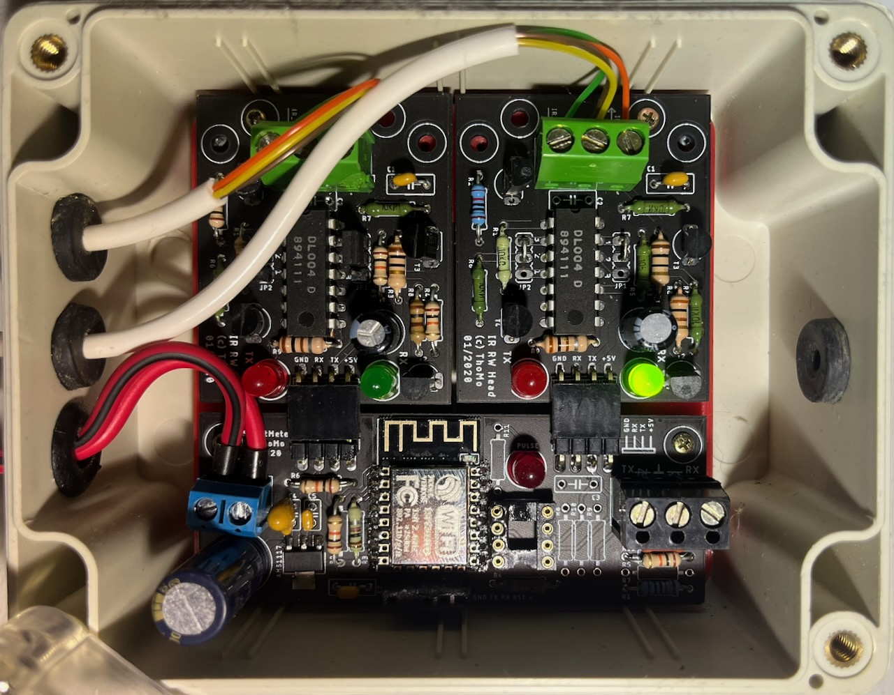
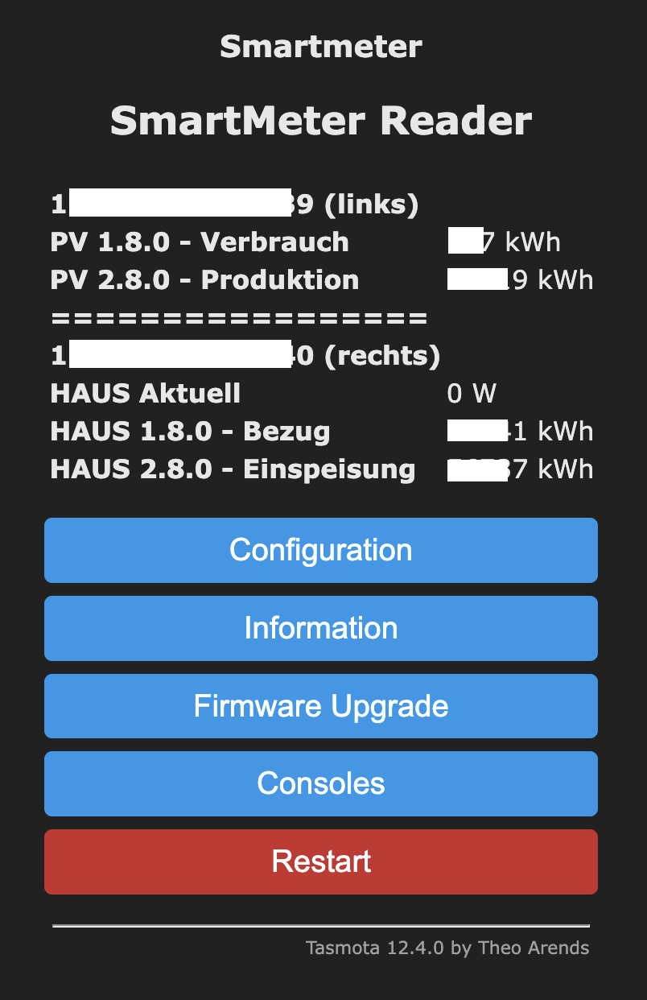

# SmartMeter Gateway

A complete hardware solution for reading data from smart energy meters via their optical interface. This project provides the PCB designs for an IR read/write head and an ESP8266-based controller board designed to run **Tasmota**.




## Overview

The SmartMeter Gateway consists of two primary components:
1.  **IR Read/Write Head**: An optical probe that attaches to the smart meter's IR port.
2.  **ESP8266 Controller Board**: A carrier board for an ESP8266 module (e.g., ESP-12F) that processes the IR signals and provides a network interface via Wi-Fi.

By running Tasmota on the ESP8266, the meter data can be easily integrated into Home Automation systems like **Home Assistant**, **OpenHAB**, or **ioBroker** using MQTT or REST API.

## Hardware

The PCB designs are located in the `board` directory. These files were created with Autocad Eagle.

### 1. IR Read/Write Head (`board/ir_rw_head`)
The IR head is responsible for the physical communication with the energy meter.
- **Schematic**: [ir_rw_head_circuit.pdf](board/ir_rw_head_circuit.pdf)
- **Files**: Eagle schematic (`.sch`) and PCB layout (`.brd`).
- **Visuals**: 
    - [Top View](board/ir_rw_head_pcb_top.png)
    - [Bottom View](board/ir_rw_head_pcb_bottom.png)

### 2. ESP8266 Controller Board (`board/smartmeter`)
The main board that houses the ESP8266 and connects to the IR head.
- **Schematic**: [smartmeter_circuit.pdf](board/smartmeter_circuit.pdf)
- **Files**: Eagle schematic (`.sch`) and PCB layout (`.brd`).
- **Visuals**:
    - [Top View](board/smartmeter_pcb_top.png)
    - [Bottom View](board/smartmeter_pcb_bottom.png)

## Software / Firmware

The board is designed to be used with the [Tasmota](https://tasmota.github.io/docs/) firmware.

### Configuration
1. Build a customized tasmota image with SML/OBIS support 
   - see [Tasmota Smart Meter Interface](https://tasmota.github.io/docs/Smart-Meter-Interface/)
   - see [HOW TO: TASMOTA SML](https://docs.google.com/document/d/1olSGZcaE_vkdNXzN_p0zGee61xKCcK3HJe3Al00xj2g/edit?usp=sharing).
2. Configure the GPIOs for the IR receiver and transmitter.
```tasmota  
{"NAME":"Smartmeter","GPIO":[1,1,1,1,1,1,1,1,0,0,1,1,1,0],"FLAG":0,"BASE":18}
```

3. Use a Tasmota Script (SML) to decode the specific data format of your energy meter (e.g., SML or OBIS) - do not forget to enable the "Enable Script" checkbox. 

Example Tasmota SML script snippet:
```tasmota
>D

>B
=>sensor53 r
>M 2
+1,13,s,0,9600,Haus
+2,12,s,0,9600,PV


;1,77070100100700FF@1,Aktuell,W,Power_curr,0
1,77070100010800FF@1000,Bezug,kWh,Tariflos,2
1,77070100020800FF@1000,Einspeisung,kWh,Tariflos,2
2,=h============
;2,77070100100700FF@1,Aktuell,W,Power_curr,0
2,77070100010800FF@1000,Verbrauch,kWh,Tariflos,2
2,77070100020800FF@1000,Produktion,kWh,Tariflos,2
#
```

## Assembly

Detailed images of the assembled boards can be found in the `images` folder.
- [Inside View](images/SmartMeter_inside.jpeg)

## License

Standard open-source licenses apply. See design files for details.
